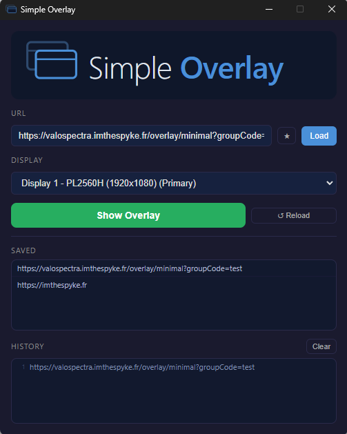

# Simple Overlay

A simple Electron app to display any website in a transparent overlay on top of your monitor.

This app is particularly useful for Esport observers who want to display the actual production overlay on their own screen, which enhances the observing experience.

## Features

* Display a website in a transparent overlay on top of any monitor
* Save URLs for later use
* History of used URLs
* Windows (macOS and Linux soon)

## Download

You can download the latest version of the app from the [Releases page](https://github.com/ImTheSpyke/simple-overlay/releases).

## License

This software is released under the MIT License. See the [LICENSE file](LICENSE.md) for details.
